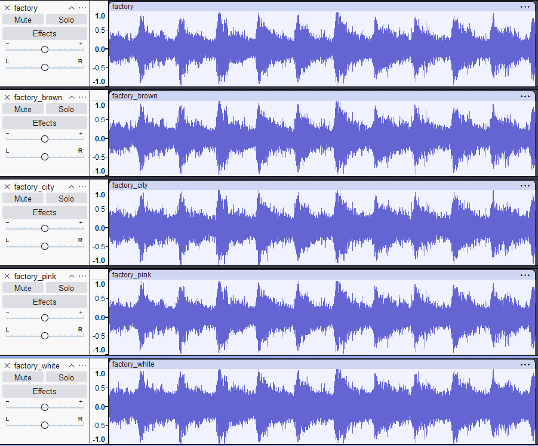
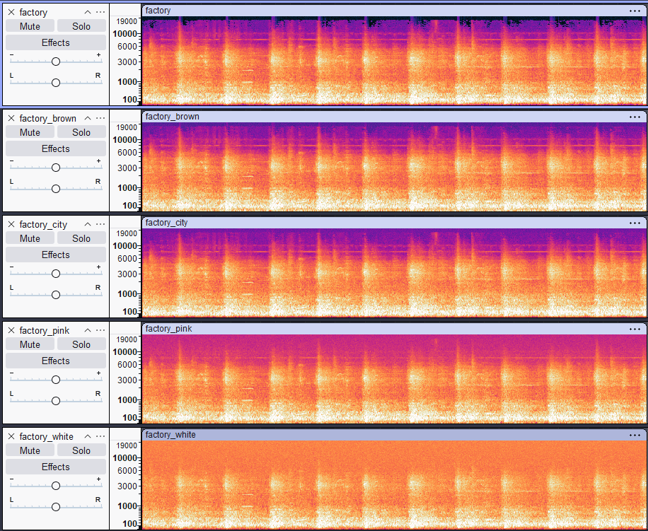
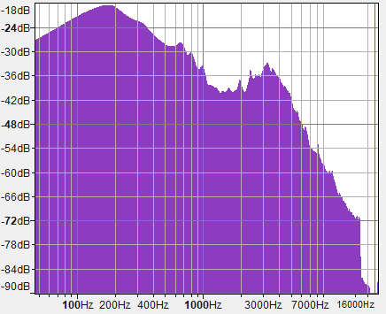
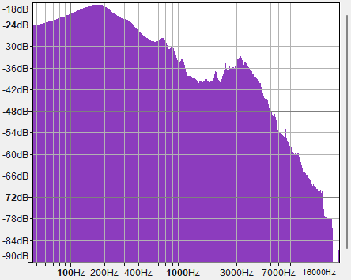
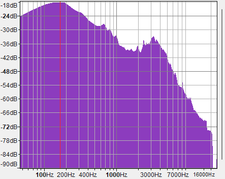
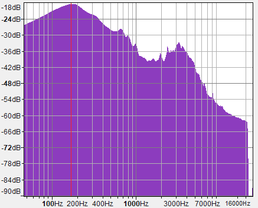
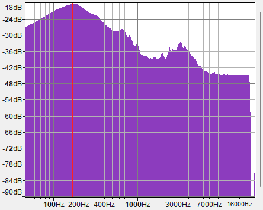
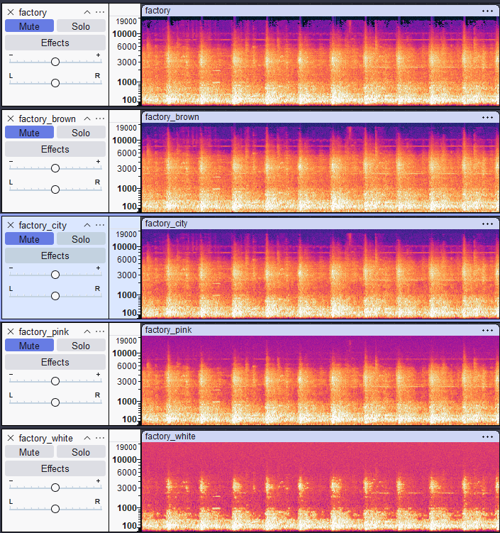
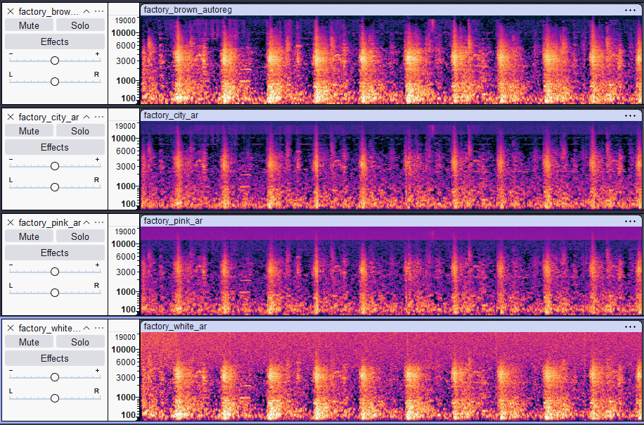

## Vremenski domen

Vremenski oblici signala ostaju prepoznatljivi kod svih verzija, ali se razlikuje zvuk tokom tiših delova signala, između udarca mašine. Šum podiže amplitudu u tim segmentima i ovo je najizraženije kod belog šuma, nešto manje kod pink šuma, a najmanje kod brown šuma i gradske buke.

## Frekventni domen

### Originalni signal

Energija je koncentrisana u niskim i srednjim frekvencijama, do oko 6kHz, dok su periodični udarci mašine jasno vidljivi (100-1000Hz, 3kHz) Visoke frekvencije od 6 do 19kHz su skoro prazne.

### Braon šum

Šum najviše dodaje energiju u niskim frekvencijama, gde signal već dominira. Visoko frekvencije su blago promenjene i udarci mašine su i dalje jasno vidljivi.

### Gradski šum

Šum koji nastaje gradskom bukom dodaje energiju slično kao i braon šum, najviše u nižim frekvencijama. Gradski šum još više utiče na niske frekvencije ispod 100Hz i energija više varira vremenski, s obzirom da nije veštački generisan.

### Roze šum

Za razliku od braon šuma, roze šum dodaje energiju ravnomernije u svim nivoima, tako da sada ima dosta šuma i u višim frekvencijama

### Beli šum

Dodaje energiju podjednako svim frekvencijama, zbog čega sada u signalu su dosta zastupljene frekvencije iznad 10kHz. Udarci se i dalje mogu prepoznati ali su manje jasni.

## Spektri

### Original

Vidimo da su najuticajnije frekvencije u opsegu 100-1000Hz kao i oko 3kHz, dok frekvencije iznad 7kHz su dosta slabije.

### Braon šum

Spektar je sličan kao kod originalnog signala, s tim da sada su frekvencije iznad 7kHz zastupljenije. Možemo da primetimo da se sada javljaju i frekvencije iznad 16kHz.

### Gradski šum

Signal sa gradskim šumom ima praktično isti spektar kao i braon šum ali dodatno pojačava niže frekvencije.

### Roze šum

Roze šum pojačava širi opseg frekvencija nego braon i roze šum, pa vidimo da su jače frekvencije iznad 7kHz nego pre.

### Beli šum

Očekivano, beli šum pojačava sve frekvencije

## Uklanjanje šuma

### Audacity

Uklanjanjem šuma u audacity možemo da primetimo da kod braon i gradskog šuma se uklanja deo viših frekvencija i uspešno se otklanja bar deo šuma.
Kod belog i roze šuma su gori rezultati, zvukovi mašine su prepoznatljivi ali čak i sa više različitih podešavanja nismo u stanju da uklonimo šum.

### Online alat

Za uklanjanje šuma je korišćen autoregresivni model. Možemo videti da model dosta bolje uklanja frekvencije koje šum doda, međutim to izaziva i veliki gubitak u kvalitetu, s obzirom da model ukloni i frekvencije koje nisu bile šum