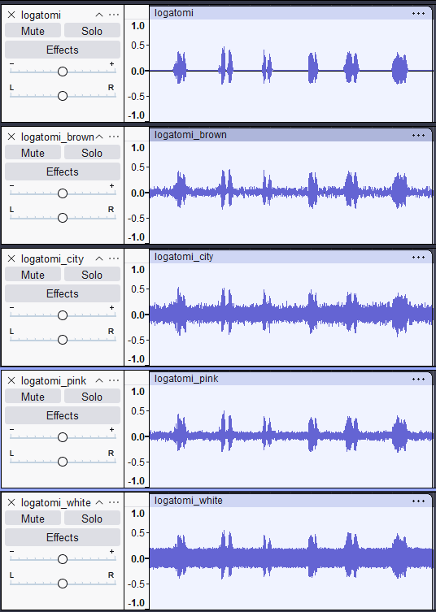
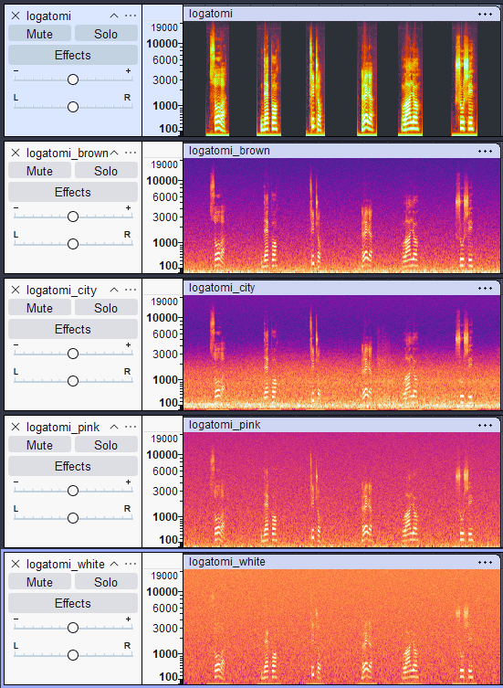
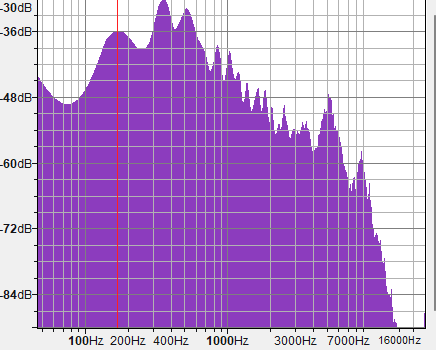
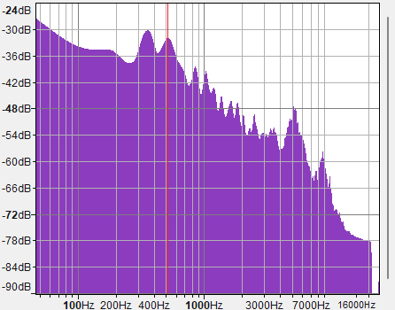
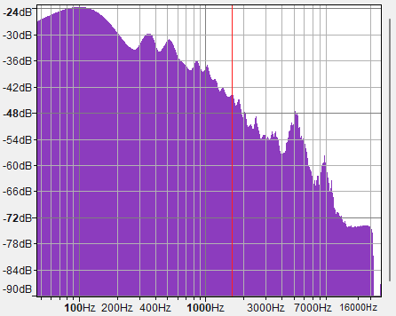
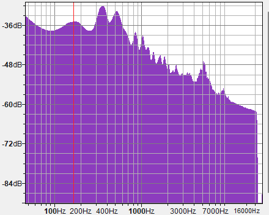
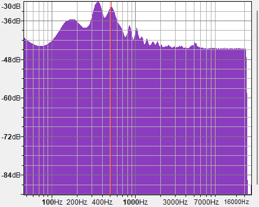
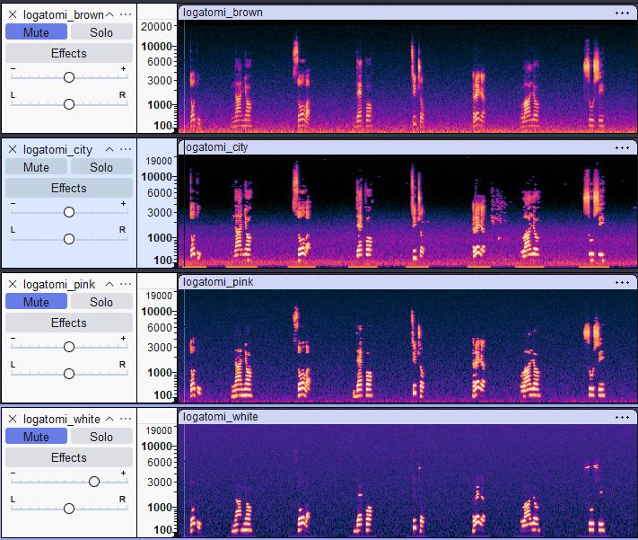
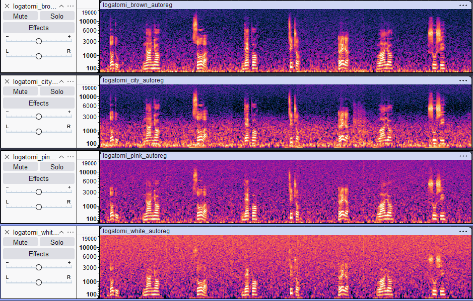

## Vremenski domen

Izgovori logotoma su jasno vidljivi kod svih signala, međutim kod belog i gradskog šuma ima dosta manje razlike između amplitude signala tokom tišine i tokom izgovaranja. Na zvuku su izgovaranja jasna i kod ovih tipova šuma.

## Frekventni domen

### Originalni signal

Kod originalnog signala su izgovori logatome jasno odvojeni periodima tišine. Pored toga možemo primetiti jasno izdvojene slogove kao i razdvojene pojaseve frekvencija tokom izgovora.

### Braon šum

Šum najviše dodaje energiju u niskim frekvencijama, međutim ne u tolikoj meri da se ne mogu prepoznati rasponi frekvencija koji su bili vidljivi kod originalnog signala.

### Gradski šum

Gradski šum dodaje energiju manje pravilno od braon šuma, najviše niskim frekvencijama i donekle srednjim, dok na frekvencije iznad 3kHz slabije utiče. Najveće pojačanje je oko 100Hz, što može uticati na visinu glasa, s obzirom da originalni signal ima visoku energiju u tom opsegu.

### Roze šum

Za razliku od braon šuma, roze šum dodaje energiju ravnomernije u svim nivoima, tako da sada ima dosta šuma i u višim frekvencijama. Kod pojedinih logatoma šum pogoršava razumljivost

### Beli šum

Dodaje energiju podjednako svim frekvencijama, zbog čega sada u signalu su prisutne sve frekvencije. Otežava razumljivost kod nekih logatoma koji sadrže zvukove kao što su s, š, č.

## Spektri

### Original

Vidimo da su najuticajnije frekvencije u opsegu 200-1000Hz kao i oko 7kHz, dok frekvencije iznad 7kHz su dosta slabije.

### Braon šum

Braon šum dosta pojačava frekvencije ispod 200Hz, što može uticati na visinu tona.

### Gradski šum

Gradski šum kao i braon šum dosta utiče na frekvencije ispod 200Hz, i to više nego braon šum. Zbog ovoga je visina tona narušena.

### Roze šum

Roze šum pojačava širi opseg frekvencija nego braon i roze šum, pa vidimo da su jače frekvencije iznad 7kHz nego pre.

### Beli šum

Očekivano, beli šum pojačava sve frekvencije

## Uklanjanje šuma

### Audacity

Uklanjanjem šuma u Audacity vidimo da je najlakše očistiti braon šum i gradski šum, pri čemu je moguće zadržati jasnoću izgovaranja. Kod roze šuma denoising uspeva da donekle održivo razumljivost, iako ima gubitka u kvalitetu, dok je signal dobijen čišćenjem belog šuma teško razumljiv.

### Online alat

Za uklanjanje šuma je korišćen autoregresivni model. Možemo videti da model dosta bolje uklanja frekvencije koje šum doda, međutim to izaziva i veliki gubitak u kvalitetu, s obzirom da model ukloni i frekvencije koje nisu bile šum.