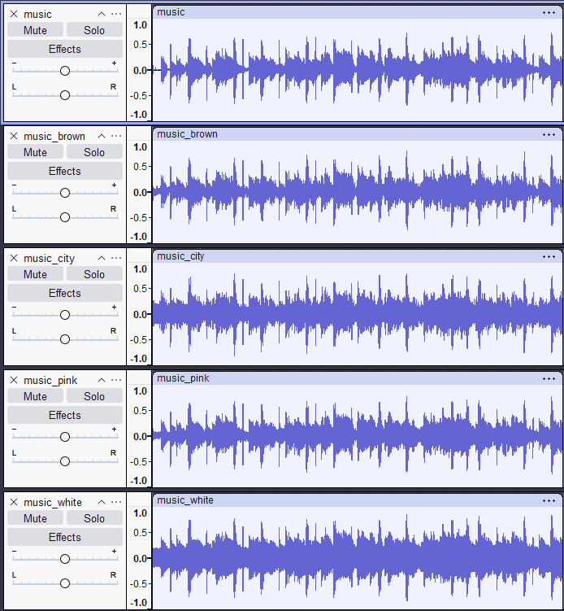
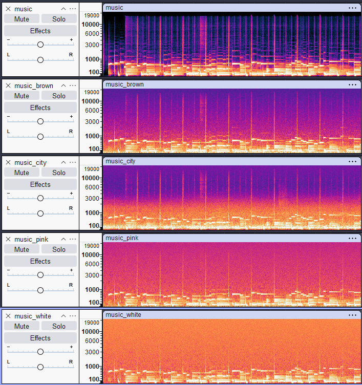
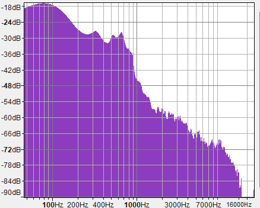
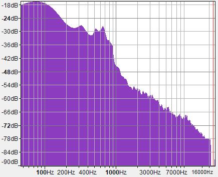
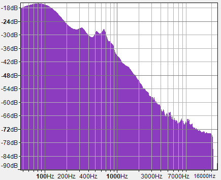
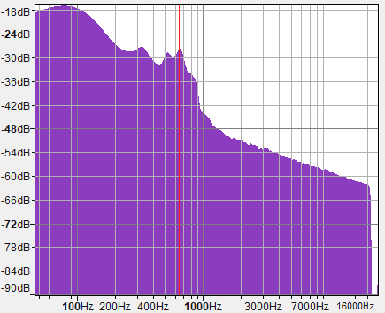
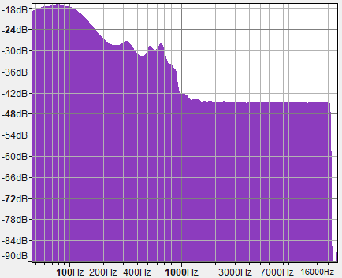
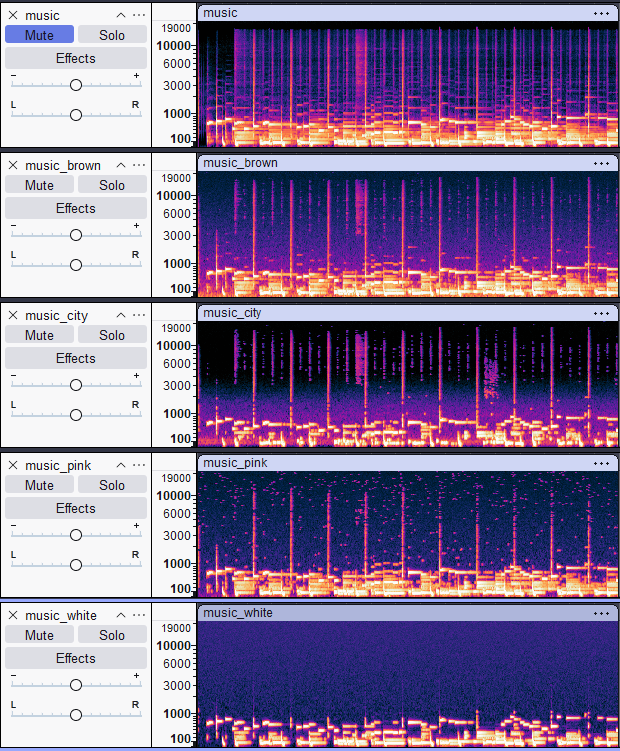
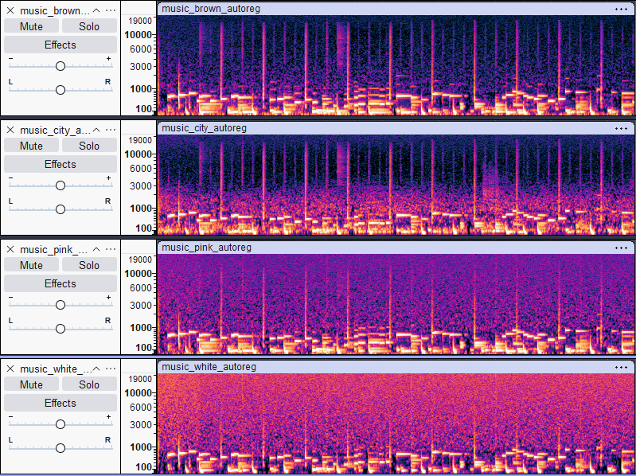

## Vremenski domen

Kod muzičkog signala nema izraženih perioda tišine, tako da se dodavanje šuma dosta teže primećuje u vremenskom domenu nego kod govora. Ipak, kod belog i gradskog šuma se vidi da su tiši delovi pesme nešto "popunjeniji", dok se kod braon i roze šuma talasni oblik manje razlikuje od originala.

## Frekventni domen

### Originalni signal

Kod originalnog signala se jasno vide frekvencije nota tokom cele pesme, kao i ritam (udarci bubnja) koji se ističu kao vertikalne linije na spektrogramu.

### Braon šum

Šum najviše dodaje energiju u niskim frekvencijama, međutim ne u tolikoj meri da znatno utiču na kvalitet zvuka.

### Gradski šum

Gradski šum dodaje energiju manje pravilno od braon šuma, najviše niskim frekvencijama i donekle srednjim, dok na frekvencije iznad 3kHz slabije utiče. Za razliku od braon šuma, na spektrogramu se povremeno javljaju i više frekvencije u okviru šuma, na primer između 7. i 8. vertikalne linije.

### Roze šum

Za razliku od braon šuma, roze šum dodaje energiju ravnomernije u svim nivoima, tako da sada ima dosta šuma i u višim frekvencijama. Zbog toga pojedini tiši detalji u pesmi, kao što su viši tonovi instrumenata, postaju teže uočljivi.

### Beli šum

Dodaje energiju podjednako svim frekvencijama, zbog čega sada u signalu su prisutne sve frekvencije podjednako jako. Vertikalne linije su teže uočljive i generalno je teže čuti instrumente u pozadini.

## Spektri

### Original

Vidimo da originalni signal ima najviše energije do oko 500Hz, sa manjim lokalnim vrhom oko 400Hz, nakon čega energija postepeno opada sve do najviših frekvencija.

### Braon šum

Braon šum se najviše preklapa sa opsegom u kom originalni signal već ima energiju, pa je razlika u odnosu na spektar originalnog signala jedva primetna.

### Gradski šum

Gradski šum, kao i braon šum, dosta utiče na frekvencije ispod 200Hz, tako da se spektar u proseku i ovde slabo razlikuje od originalnog signala.

### Roze šum

Roze šum pojačava širi opseg frekvencija nego braon i gradski šum, pa se kod viših frekvencija (iznad 3-4kHz) spektar sporije spušta i ostaje na nešto višem nivou nego kod originala.

### Beli šum

Očekivano, beli šum najviše menja izgled spektra. Umesto prirodnog opadanja ka visokim frekvencijama, spektar iznad 1kHz postaje skoro potpuno ravan, na nivou dosta iznad onoga kod originalnog signala.

## Uklanjanje šuma

### Audacity

Uklanjanjem šuma u Audacity vidimo da je najlakše očistiti braon šum i gradski šum, pri čemu kvalitet ostaje relativno dobro očuvan. Kod roze šuma denoising donekle uspeva da očuva melodiju, iako ima gubitka u kvalitetu, dok je signal dobijen čišćenjem belog šuma i dalje dosta zašumljen i teško se prepoznaju detalji pesme.

### Online alat

Za uklanjanje šuma je korišćen autoregresivni model. Možemo videti da model bolje održava vertikalne linije ali i dalje ima dosta šuma koji možemo da čujemo.